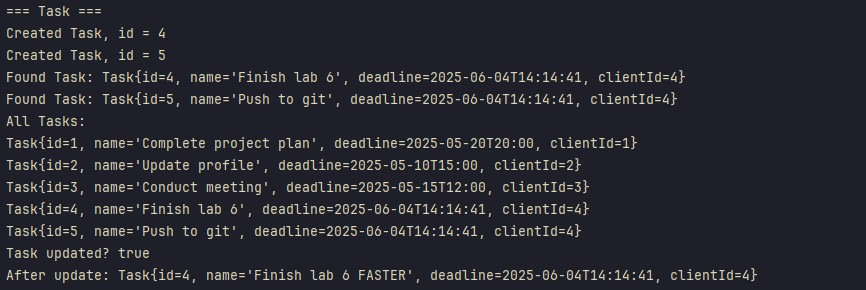

# Тестування працездатності системи

Код для тесту має наступний вигляд:

``` java
package db;

import db.dao.*;
import db.model.*;

import java.time.LocalDateTime;
import java.util.List;
import java.util.Optional;

public class Test {

  public static void main(String[] args) {
    try {
      RoleDAO roleDAO = new RoleDAO();
      ClientDAO clientDAO = new ClientDAO();
      TaskDAO taskDAO = new TaskDAO();
      RequestDAO requestDAO = new RequestDAO();
      RequestConfirmationDAO rcDAO = new RequestConfirmationDAO();
      UserMessageDAO userMessageDAO = new UserMessageDAO();

      // Role
      System.out.println("=== Role ===");
      Role r1 = new Role(null, "Tester", "LIMITED", "Test role");
      Long r1Id = roleDAO.create(r1);
      System.out.println("Created Role, id = " + r1Id);

      Optional<Role> maybeR = roleDAO.findById(r1Id);
      maybeR.ifPresent(r -> System.out.println("Found Role: " + r));

      List<Role> allRoles = roleDAO.findAll();
      System.out.println("All Roles:");
      allRoles.forEach(System.out::println);

      r1.setId(r1Id);
      r1.setDescription("Updated description for Tester");
      boolean roleUpdated = roleDAO.update(r1);
      System.out.println("Role updated? " + roleUpdated);
      roleDAO.findById(r1Id).ifPresent(r -> System.out.println("After update: " + r));

      boolean roleDeleted = roleDAO.delete(r1Id);
      System.out.println("Role deleted? " + roleDeleted);
      System.out.println("Role still exists? " + roleDAO.findById(r1Id).isPresent());
      System.out.println();

      // Client
      System.out.println("=== Client ===");
      // Створимо роль для клієнта
      Role baseRole = new Role(null, "BaseRole", "LIMITED", "Base role");
      Long baseRoleId = roleDAO.create(baseRole);

      Client c1 = new Client(null, "Nahornyi Danylo", "coolEmail@example.com", "12344321", baseRoleId);
      Long c1Id = clientDAO.create(c1);
      System.out.println("Created Client, id = " + c1Id);

      Optional<Client> maybeClient = clientDAO.findById(c1Id);
      maybeClient.ifPresent(c -> System.out.println("Found Client: " + c));

      List<Client> allClients = clientDAO.findAll();
      System.out.println("All Clients:");
      allClients.forEach(System.out::println);

      // Оновимо клієнта
      c1.setId(c1Id);
      c1.setMail("newCoolEmail@example.com");
      boolean clientUpdated = clientDAO.update(c1);
      System.out.println("Client updated? " + clientUpdated);
      clientDAO.findById(c1Id).ifPresent(c -> System.out.println("After update: " + c));

      // Task
      System.out.println("=== Task ===");
      LocalDateTime dl = LocalDateTime.now().plusDays(2);
      Task t1 = new Task(null, "Finish lab 6", dl, c1Id);
      Long t1Id = taskDAO.create(t1);
      System.out.println("Created Task, id = " + t1Id);

      Task t2 = new Task(null, "Push to git", dl, c1Id);
      Long t2Id = taskDAO.create(t2);
      System.out.println("Created Task, id = " + t2Id);

      Optional<Task> maybeTask1 = taskDAO.findById(t1Id);
      maybeTask1.ifPresent(t -> System.out.println("Found Task: " + t));
      Optional<Task> maybeTask2 = taskDAO.findById(t2Id);
      maybeTask2.ifPresent(t -> System.out.println("Found Task: " + t));

      List<Task> allTasks = taskDAO.findAll();
      System.out.println("All Tasks:");
      allTasks.forEach(System.out::println);

      // Змінимо назву завдання
      t1.setId(t1Id);
      t1.setName("Finish lab 6 FASTER");
      boolean taskUpdated = taskDAO.update(t1);
      System.out.println("Task updated? " + taskUpdated);
      taskDAO.findById(t1Id).ifPresent(t -> System.out.println("After update: " + t));

      // Request
      System.out.println("=== Request ===");
      LocalDateTime rt = LocalDateTime.now();
      Request req1 = new Request(null, "Help needed", rt, "Need help with lab 6", c1Id);
      Long req1Id = requestDAO.create(req1);
      System.out.println("Created Request, id = " + req1Id);

      Optional<Request> maybeReq = requestDAO.findById(req1Id);
      maybeReq.ifPresent(r -> System.out.println("Found Request: " + r));

      List<Request> allRequests = requestDAO.findAll();
      System.out.println("All Requests:");
      allRequests.forEach(System.out::println);

      // RequestConfirmation
      System.out.println("=== RequestConfirmation ===");
      LocalDateTime rct = LocalDateTime.now().plusHours(1);
      RequestConfirmation rc1 = new RequestConfirmation(null, true, rct, c1Id);
      Long rc1Id = rcDAO.create(rc1);
      System.out.println("Created RequestConfirmation, id = " + rc1Id);

      Optional<RequestConfirmation> maybeRc = rcDAO.findById(rc1Id);
      maybeRc.ifPresent(rc -> System.out.println("Found RequestConfirmation: " + rc));

      List<RequestConfirmation> allRC = rcDAO.findAll();
      System.out.println("All RequestConfirmations:");
      allRC.forEach(System.out::println);

      System.out.println("=== UserMessage ===");
      LocalDateTime umt = LocalDateTime.now().plusMinutes(5);

      UserMessage um1 = new UserMessage(null, "Your request is approved!", umt, rc1Id, c1Id);
      Long um1Id = userMessageDAO.create(um1);
      System.out.println("Created UserMessage, id = " + um1Id);

      Optional<UserMessage> maybeUm = userMessageDAO.findById(um1Id);
      maybeUm.ifPresent(um -> System.out.println("Found UserMessage: " + um));

      List<UserMessage> allUM = userMessageDAO.findAll();
      System.out.println("All UserMessages:");
      allUM.forEach(System.out::println);

    } catch (Exception e) {
      e.printStackTrace();
    }
  }
}
```
Результати виконання:

Створено, змінено, та видалено нову роль:


Створено нову роль, та клієнта з нею; Змінено пошту клієнта:


Створено 2 задачі, у одної змінено назву:


Створено новий запит:


Створено підтвердження для цього запиту:


Створено повідомлення:

