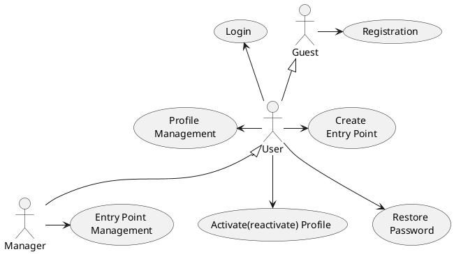

# Розроблення функціональних вимог до системи

## Модель прецедентів

В цьому файлі необхідно перелічити всі документи, розроблені в проекті та дати посилання на них.

*Модель прецедентів повинна містити загальні оглядові діаграми та специфікації прецедентів.*


Вбудовування зображень діаграм здійснюється з використанням сервісу [plantuml.com](https://plantuml.com/). 

В markdown-файлі використовується опис діаграми

```md

<center style="
    border-radius:4px;
    border: 1px solid #cfd7e6;
    box-shadow: 0 1px 3px 0 rgba(89,105,129,.05), 0 1px 1px 0 rgba(0,0,0,.025);
    padding: 1em;"
>

@startuml
actor Guest
  actor User
  actor Manager
  
  usecase Registration
  usecase "Activate(reactivate) Profile" as AP
  usecase Login
  
  usecase "Profile \nManagement" as PM
  usecase "Create \nEntry Point" as CEP
  usecase "Entry Point \nManagement" as EPM
  usecase "Restore \nPassword" as RP
  
  
  User -u-|> Guest
  Manager -u-|> User
  
  Guest -> Registration
  
  User -u-> Login
  User -l-> PM
  User -> CEP
  User --> AP
  User --> RP
  
  Manager -> EPM
@enduml

**Діаграма прецедентів**

</center>
```

яка буде відображена наступним чином

<center style="
    border-radius:4px;
    border: 1px solid #cfd7e6;
    box-shadow: 0 1px 3px 0 rgba(89,105,129,.05), 0 1px 1px 0 rgba(0,0,0,.025);
    padding: 1em;"
    >




**Діаграма прецедентів**

</center>
