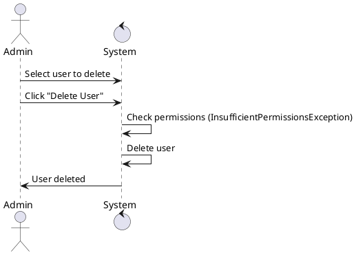

# Розроблення функціональних вимог до системи

## Модель прецедентів

```plantuml
@startuml
actor Admin
control System
Admin -> System: Select user to delete
Admin -> System: Click "Delete User"
System -> System: Check permissions (InsufficientPermissionsException)
System -> System: Delete user
System -> Admin: User deleted
@enduml
```

**Діаграма прецедентів**
<<<<<<< HEAD

=======
>>>>>>> ec01b3cd322421c6d409217f69138692a719a2f3

